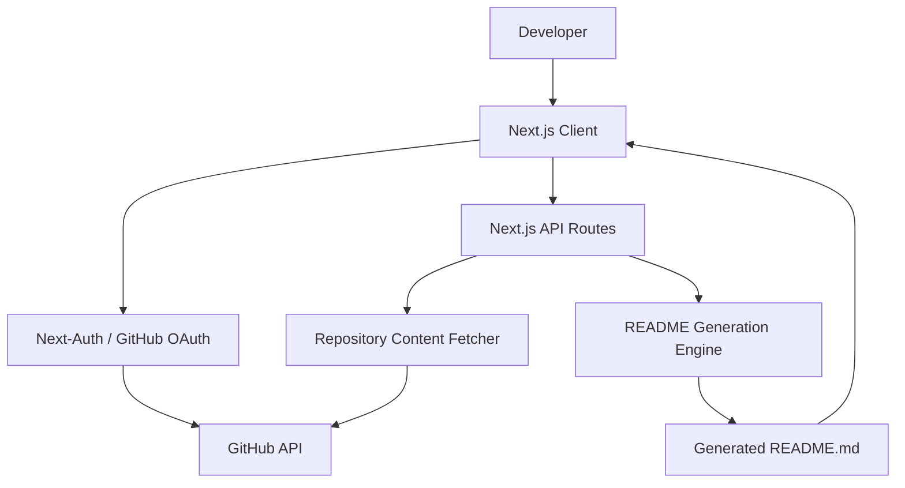
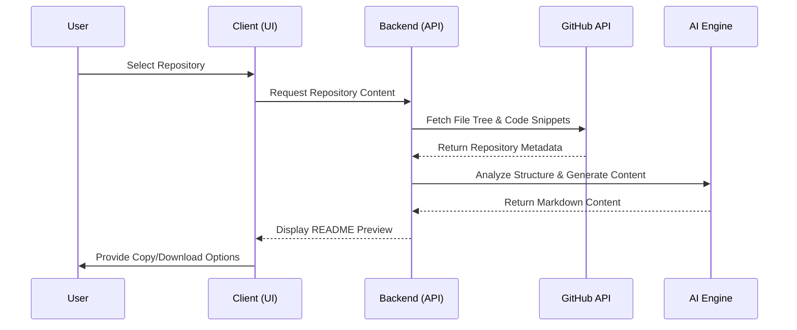

# docify
### AI-Powered Professional Documentation Generator for GitHub Repositories


docify is an automated technical documentation tool designed to analyze GitHub repository structures and source code to generate comprehensive, professional README.md files. By leveraging AI and the GitHub API, it eliminates the manual overhead of writing project documentation while ensuring consistency and technical accuracy.

---

## Visual Diagrams

### System Architecture
The following diagram illustrates the high-level architecture of docify, showing the interaction between the client, the Next.js backend, and external services.



### Data Flow Sequence
This sequence diagram shows the process of generating documentation from a user's repository selection.



---

## Problem Statement
Writing high-quality documentation is a time-consuming task that developers often neglect in favor of coding. Poorly documented repositories lead to low adoption rates, increased onboarding time for contributors, and a lack of professional presentation. Manual documentation also becomes outdated quickly as the project structure evolves.

---

## Solution Overview
docify solves this by automating the documentation lifecycle. It authenticates with GitHub to access repository metadata, parses the directory structure, and utilizes language models to understand the project's purpose. It then generates a structured README based on industry best practices, including architecture diagrams and setup instructions, ensuring that documentation stays synchronized with the codebase.

---

## Key Features
- **GitHub OAuth Integration**: Securely access public and private repositories using Next-Auth.
- **Dynamic File Tree Visualization**: Interactive exploration of repository structures.
- **Automated Content Analysis**: Automatically identifies tech stacks and project goals.
- **Professional Templates**: Generates documentation following standardized technical writing patterns.
- **Live Preview**: Real-time rendering of generated Markdown with syntax highlighting.
- **Copy-to-Clipboard**: One-click utility to integrate the generated content into the project.

---

## Tech Stack

| Category | Technology | Purpose |
| :--- | :--- | :--- |
| Frontend Framework | Next.js 15 (App Router) | Server-side rendering and routing |
| Language | TypeScript | Type safety and improved developer experience |
| Styling | Tailwind CSS | Responsive and utility-first UI design |
| UI Components | Radix UI / Shadcn | Accessible and consistent interface elements |
| Authentication | Next-Auth.js | GitHub OAuth provider integration |
| API Handling | Fetch API | Communication with GitHub and internal routes |

---

## Quick Start / Installation

### Prerequisites
- Node.js (Latest LTS recommended)
- GitHub Developer Account (for OAuth credentials)

### Setup Steps
1. Clone the repository:
   ```bash
   git clone https://github.com/TanmayAggarwal87/docify.git
   cd docify
   ```

2. Install dependencies:
   ```bash
   npm install
   ```

3. Configure environment variables (see Environment Variables section).

4. Run the development server:
   ```bash
   npm run dev
   ```

5. Build for production:
   ```bash
   npm run build
   ```

---

## Environment Variables

| Variable | Description | Example | Required |
| :--- | :--- | :--- | :--- |
| GITHUB_ID | GitHub OAuth App Client ID | `Ov23...` | Yes |
| GITHUB_SECRET | GitHub OAuth App Client Secret | `6f7d...` | Yes |
| NEXTAUTH_SECRET | Secret used to hash tokens | `your-random-secret` | Yes |
| NEXTAUTH_URL | The base URL of your application | `http://localhost:3000` | Yes |

Example `.env` block:
```env
GITHUB_ID=your_client_id
GITHUB_SECRET=your_client_secret
NEXTAUTH_SECRET=a_very_secure_random_string
NEXTAUTH_URL=http://localhost:3000
```

---

## API Endpoints

| Method | Endpoint | Description | Auth |
| :--- | :--- | :--- | :--- |
| GET | `/api/auth/[...nextauth]` | Handles GitHub OAuth lifecycle | No |
| POST | `/api/generateReadme` | Generates MD content based on repo data | Yes |
| GET | `/api/token` | Retrieves the current session token | Yes |

Example Request:
```bash
curl -X POST http://localhost:3000/api/generateReadme \
  -H "Content-Type: application/json" \
  -d '{"repoName": "docify", "structure": [...]}'
```

---

## Project Structure

```text
docify/
├── public/              # Static assets (SVGs, Icons)
├── src/
│   ├── app/             # Next.js App Router (Pages & APIs)
│   │   ├── api/         # Backend endpoints
│   │   ├── repos/       # Dynamic repository routes
│   │   └── layout.tsx   # Global layout
│   ├── components/      # React components
│   │   ├── ui/          # Reusable Shadcn components
│   │   └── Hero.tsx     # Feature-specific components
│   ├── lib/             # Utility functions
│   └── auth.ts          # Authentication configuration
├── components.json      # Shadcn configuration
├── next.config.ts       # Next.js configuration
└── tsconfig.json        # TypeScript configuration
```

---

## Deployment & Architecture Decisions

### Hosting: Vercel
The project is optimized for Vercel. This choice was made due to the seamless integration with Next.js features like Server Actions and API routes, as well as the ease of managing environment variables and preview deployments.

### Decision: Client-Side vs Server-Side Data Fetching
GitHub repository listing is performed on the server side via Next-Auth tokens to prevent exposing sensitive access tokens to the browser. However, the README generation preview is handled through API routes to allow for asynchronous streaming of content in future iterations.

---

## Technical Challenges & Solutions

### Challenge 1: GitHub API Rate Limiting
**Problem**: Large repositories with deep nesting hit GitHub's API rate limits quickly when fetching file contents.
**Solution**: Implemented a recursive tree-fetching algorithm that only requests top-level structures first. File contents are fetched selectively based on the AI's requirements rather than scanning every binary or dependency file.

### Challenge 2: Context Window Management
**Problem**: Passing an entire repository's code to an AI model exceeds context limits.
**Solution**: Developed a filtering mechanism in `src/app/api/fetchReposContent.ts` that ignores `node_modules`, lock files, and assets, focusing only on configuration files and core source code to provide the most relevant context for generation.

---

## Development Commands

- `npm run dev`: Starts the local development server with hot reloading.
- `npm run build`: Compiles the application for production.
- `npm run start`: Runs the compiled production build.
- `npm run lint`: Executes ESLint for code quality checks.

---

## Testing Approach
The current state focuses on manual integration testing for OAuth flows and API response validation. Future plans include:
- **Unit Testing**: Using Vitest for utility functions in `src/lib`.
- **E2E Testing**: Implementing Playwright to test the full flow from login to README generation.

---

## Contributing Guidelines
Contributions are welcome. If you have ideas for better README templates or improved parsing logic, please feel free to fork the repository and submit a pull request. We value clear code and concise documentation in all submissions.

---

## Author Section
Built by [Tanmay Aggarwal](https://github.com/TanmayAggarwal87)

---

## License
This project is licensed under the MIT License.

--made by docify--
